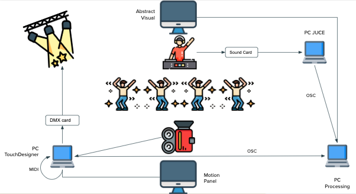
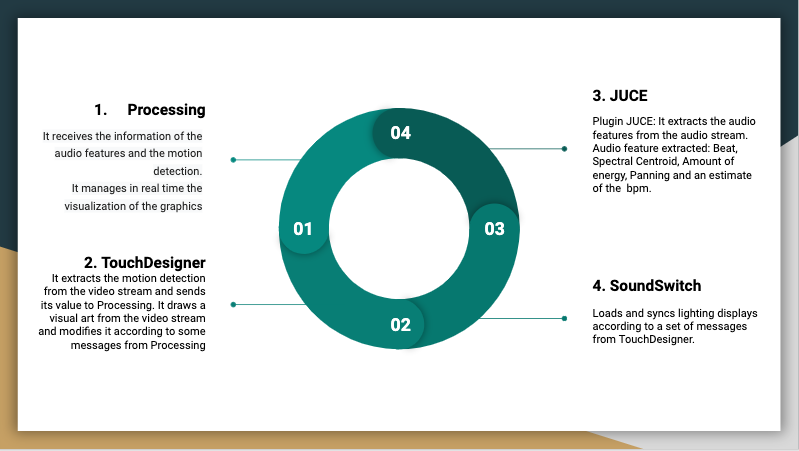

# VISUALIVE
 
## What is VisuaLive
 
VisuaLive is a set of software thought to handle, modify and generate in a smart way the graphic part and control the lighting system of an interactive music installation
 
 
## Idea and Goal
 
The idea is to give an alternative visual experience to the audience, inside an experimental installation.
The goal is to realize a system where all the visual components (visual and lights) of the performance are controlled by the system autonomously, and modified thanks to the amount of motion of the public and the audio features extracted in real time from the audio.

## The installation

  

VisuaLive is thought to be used inside an experimental installation, hosted in a medium-sized room with a small number of people, where an electronic music performance is hosted.
The installation is ideated in a way that the user can enjoy this experience realizing on his own how all the system works, thanks to his visual and auditory sense.
There are two panels, where two different graphics are showed.
The first one is a graphic handled by Touch Designer which varies with the motion detected by a camera. The camera captures the movement of the people and this value will be used from the other graphic to modify its parameters. The user interacts with the system thanks to the visual feedback of the graphic, that change accordingly to the motion.
The second one is the main panel. It shows the graphic handled by Processing. This is shown on the main panel of the installation and it represents the abstract visual art of the performance. 
 

# Software

-Processing.
-TouchDesigner.
-Juce.
-SoundSwitch.

  

   
 
## Communication and Protocols

* The audio output of the artist is connected to a sound card. The sound card is connected to the first computer which runs the Juce sketch.
* The values extracted by the Juce sketch are sent to the second computer with OSC message.
* The second computer which runs Processing sketch is connected to the main panel by a projector or by HDMI
* The third computer which runs Touch Designer sketch is connected to the second panel by a projector or by HDMI.
* The third computer sends motion values to the second one with OSC messages.
* The second computer sends an OSC message to the third one if the motion bar is full.
* The third computer sends MIDI message to himself to trigger SoundSwitch, that runs on the same computer.
* The third computer is connected to a DMX Light with U-DMX cable, and it sends DMX values to the light

## Processing

The processing sketch is composed of a set of visual arts and a scheduler.
The sketches of the visuals are written by the authors. Each visual has some parameters controlled by the audio features extracted by the JUCE’s plugin, and others controlled by the amount of motion detected by the TouchDesigner camera.
The scheduler chooses the visual art to show, according to the BPM detected by the JUCE’s plugin of the music.

# Scheduler Algorithm:

When a new BPM is detected from the JUCE’s plugin it is send to Processing with OSC.
If no other BPM values are detected for 5 seconds, the scheduler function is triggered, otherwise, it waits until other BPM values come.
Each visual is associated to a specific range of BPM. The scheduler chooses one visual in the range of the BPM detected, in a random way.
Processing draws the new selected graphic.
It sends an OSC message to TouchDesigner, which changes the color of its visual, in order to have a visual feedback of the change also in the second panel

# Motion Bar:

There is a panel in the upper-left side of the screen which is filled with the sum of the motion values sent from TouchDesigner. The function of the bar is to represent the motion of the public: it grows if the motion is detected, otherwise it decreases.
Algorithm: 
* Each motion value received is scaled in a new range, from 0 to the max value detected (continuously updated), to the new range [-0.05,1]
* These values are continuously summed up. 
* If this sum is over a certain threshold, an OSC message is sent to TouchDesigner. The function of this message is to trigger the lighting system.

# JUCE

The plugin is realized with Juce, a C++ application framework.
This plugin was realized to automate the control of the lighting of an architectural structure composed by LED stripes in a dynamic and smart way, during an electronic music show. The idea was to create a beat detector algorithm in order to trigger a certain light pattern, modifying the parameter of this pattern using other audio features.
You can see how it works in detail at the following link: https://github.com/Karwelox/Festivalle

It analyzes the song played in real time and it calculates:
1. Beat detection
2. Spectral centroid
3. Amount of energy
4. Panning value
5. BPM value.

## BPM detection algorithm

The algorithm is a real-time estimate of the current played song. It is optimized for electronic music with the presence of a drum pattern composed mainly by a kick and a snare. It is base on the beat detection algorithm.
The bpm calculated is an estimate of the actual BPM value of the song. 
We use this value as a mathematical estimate to understand what kind of song the artist is playing, and to trigger to proper abstract graphic to show.

Beat detection algorithm: it detects the presence of a beat in the current frame of the FFT
If a beat is detected, it saves the time when the beat is detected in a queue
If the queue is full, It calculates the variance of the distance of the times.
If the variance is under a certain threshold, we calculate the BPM as :                                                         sum of the delta times of the queue / size of the queue.
The bpm values is updated, unless it is similar to the previous BPM value detected. 

# TOUCHDESIGNER

The TouchDesigner sketch is composed of three main parts:
1. The motion detection algorithm from the video stream and the relative forwarding of its value to Processing through OSC.
2. Particles visual art based on the original video stream with variations according to messages from the main through OSC.
3. Communication with Sound Switch for triggering the light event, through MIDI protocol.

# SOUND SWITCH

It is a software used to trigger the lightning system, choosing the proper sequence of DMX values to send. 
For the demonstration we used only one light, and we decided to use a sequence to represent a stroboscopic effect.
If the motion bar of the main panel is full, Processing sends an OSC message to TouchDesigner, which sends a MIDI message that activates the sequence.
After a certain period of time, written by the authors, Processing sends another OSC message to TouchDesigner to stop the stroboscopic effect.
The idea is to activate a strong light sequence when a lot of motion is detected.

## References

## Software Developer Team

Carmelo Fascella
Francesco Pino
Edoardo Epifani
